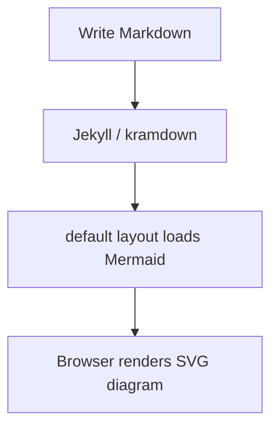

# elemer.net

A minimal personal website built with Jekyll and hosted on GitHub Pages.

Live at **[elemer.net](https://elemer.net)**.

## Design principles

1. **Speed.** Static HTML, served from GitHub Pages' global CDN. CSS is inlined; no web fonts; no JavaScript framework.
2. **Minimal.** A 650px column, system fonts, pure black on white. The content is the design.
3. **Markdown-first.** Normal writing lives in `_markdown/`. Raw HTML is reserved for standalone interactive pages in `_html/`.
4. **Reusable article components.** Common objects such as YouTube videos, Mermaid diagrams, figures, callouts, file cards, tables, blockquotes, and footnotes have stable site-level styling.
5. **LaTeX support.** MathJax loads by default on every page so any post can use `$...$` and `$$...$$`.
6. **Drop-in publishing.** Drop a file into the right folder, add front matter, run `./publish.sh`.
7. **Safety checks.** Local publishing and CI check front matter, permalink shape, duplicate permalinks, root-level Markdown mistakes, YouTube embed mistakes, and unsafe encrypted posts in public repos.
8. **Private by default.** No analytics, no RSS feed, no search-engine indexing, no opt-in for AI training crawlers. Sharing is for humans you send the link to.

## Folder layout

```
.
├── _config.yml              # Jekyll config
├── _includes/
│   └── youtube.html         # Reusable responsive YouTube embed
├── _layouts/
│   ├── default.html         # Site shell, inlined CSS, MathJax, Mermaid, article components
│   └── post.html            # Wrapper for markdown posts and TOC
├── _markdown/               # Markdown posts; all normal writing goes here
├── _html/                   # Standalone HTML pages
├── assets/
│   └── favicon.svg
├── index.html               # Homepage; lists items with `listed: true`
├── 404.html                 # Custom not-found page
├── robots.txt               # Crawler / AI-bot deny list
├── CNAME                    # Custom domain (elemer.net)
├── publish.sh               # One-command publish script
├── package.json             # Node scripts and formatter dependency
├── scripts/
│   ├── check.mjs            # Publishing safety checks
│   ├── encrypt.mjs          # Encrypts articles with `encrypted: true`
│   ├── fetch-images.sh      # Caches selected external images
│   ├── format.mjs           # Chinese typography formatter
│   └── has-encrypted.mjs    # Lets CI skip double-builds when no encrypted posts exist
└── .github/workflows/
    └── jekyll.yml           # GitHub Pages build action
```

## Writing a new post

### Markdown post

All normal writing lives in `_markdown/`. Do not place essay Markdown files in the repository root.

1. Create a file in `_markdown/`, e.g. `_markdown/my-essay.md`.
2. Add front matter at the top:

   ```yaml
   ---
   title: My Essay
   permalink: /my-essay/
   listed: true
   ---
   ```

3. Write the body in Markdown. Files in `_markdown/` automatically use the site post template, so they keep the normal Elemer layout, article width, title styling, TOC behavior, typography, component styling, MathJax support, and opt-in Mermaid support.

4. Run `./publish.sh`.

### Front matter reference

Every Markdown post should use this schema:

| Field       | Required | Purpose                                                                  |
| ----------- | -------- | ------------------------------------------------------------------------ |
| `title`     | yes      | Shown on the homepage list and in the browser tab                        |
| `permalink` | yes      | The URL the file is served at, e.g. `/my-essay/`; must start/end with `/` |
| `listed`    | yes      | `true` to appear on the homepage; `false` to hide                        |

Optional:

| Field       | Purpose                                                                            |
| ----------- | ---------------------------------------------------------------------------------- |
| `math`      | Set `false` to skip MathJax on a page (useful if `$...$` is used for prices, etc.) |
| `mermaid`   | Set `true` to render Mermaid fenced code blocks on this page.                      |
| `lang`      | Page language. Defaults to `zh-CN`; use `en` for English pages.                   |
| `encrypted` | Set `true` for password-locked articles. Only safe if the repo is private.        |
| `password`  | Password for encrypted articles. Keep ASCII.                                      |

There are deliberately no `date` fields. This site publishes long-half-life writing, not a reverse-chronological feed.

## Article components

### LaTeX

LaTeX works out of the box in Markdown posts:

```markdown
Inline math: $E = mc^2$

Display math:
$$\int_0^\infty e^{-x^2}\,dx = \frac{\sqrt{\pi}}{2}$$
```

MathJax can be disabled per page with:

```yaml
math: false
```

### Mermaid diagrams

Mermaid is opt-in per page. Add this to front matter when a Markdown post needs diagrams:

```yaml
mermaid: true
```

Then use a standard Markdown fenced code block with `mermaid` as the language:

````markdown

````

Rules:

- Put `mermaid: true` in the page front matter before using Mermaid code blocks.
- Use fenced code blocks: ```` ```mermaid ````.
- Keep Mermaid in Markdown posts under `_markdown/`; standalone HTML pages can load their own scripts if needed.
- The site converts `pre > code.language-mermaid` blocks into Mermaid diagrams in `_layouts/default.html`.

### YouTube videos

Use the reusable include, not hand-written iframe markup:

```liquid

```

The `title` field is optional:

```liquid

```

Convert normal YouTube links into video IDs:

```text
https://youtu.be/EN7frwQIbKc?si=D_1rJ6gba2Wj9Z8M
```

The video ID is:

```text
EN7frwQIbKc
```

The include automatically renders the responsive embed URL:

```text
https://www.youtube.com/embed/EN7frwQIbKc
```

Rules:

- Put the include directly in the Markdown body where the video should appear.
- Prefer `` over hand-written iframe markup.
- Do not use `youtu.be` or `youtube.com/watch` inside an iframe.
- When showing Liquid include syntax inside a code block, wrap the example in `...` so Jekyll does not execute it.

### Figures and captions

Use `<figure>` when an image needs a caption:

```html
<figure>
  
  <figcaption>Figure 1: Short caption.</figcaption>
</figure>
```

Images and captions are responsive by default.

### Callouts

Use `.callout` for short emphasis blocks:

```html
<div class="callout">
  <p><strong>Note:</strong> This is a compact callout.</p>
</div>
```

### File cards

Use `.file-card` for download or reference links that should stand apart from normal inline links:

```html
<a class="file-card" href="/files/example.pdf">
  <div class="file-card-title">Example PDF</div>
  <div class="file-card-desc">A short description of what this file contains.</div>
</a>
```

### Tables

Regular Markdown tables are horizontally scrollable on mobile:

```markdown
| Metric | Meaning |
| ------ | ------- |
| MI     | Mutual information |
```

For complex raw HTML tables, wrap them manually:

```html
<div class="table-wrap">
  <table>
    <tr><th>Metric</th><th>Meaning</th></tr>
    <tr><td>MI</td><td>Mutual information</td></tr>
  </table>
</div>
```

## Standalone HTML page

Standalone HTML is for full custom pages, animations, or interactive pieces that should not inherit the normal post layout.

1. Create a file in `_html/`, e.g. `_html/compound.html`.
2. Add front matter at the very top of the file, above `<!DOCTYPE html>`:

   ```yaml
   ---
   title: "Compound · A Memo to CEO"
   permalink: /compound/
   listed: true
   ---
   <!DOCTYPE html>
   <html>
     ...
   </html>
   ```

3. Run `./publish.sh`.

The HTML file is served as-is, with no layout wrapping. It can include its own CSS, JS, fonts, animations — anything.

## Publishing checks

`./publish.sh` runs two steps before committing:

```bash
node scripts/format.mjs _markdown/*.md index.html
node scripts/check.mjs
```

The check script blocks publishing when it finds hard errors:

- essay Markdown files outside `_markdown/`
- missing front matter in `_markdown/*.md` or `_html/*.html`
- missing `title`, `permalink`, or explicit `listed` (in either collection)
- front matter values that would silently break Ruby YAML, e.g. an unquoted `title: Foo: bar` (the `: ` makes Ruby parse it as a nested mapping and Jekyll drops the file). Wrap such values in quotes: `title: "Foo: bar"`
- front matter lines that aren't a flat `key: value` pair, contain tabs, or are indented
- permalinks that do not start and end with `/`
- duplicate permalinks
- YouTube iframes that use `youtu.be` or `youtube.com/watch`
- `encrypted: true` in a public repo, when CI reports the repo visibility as public

It also prints warnings for softer issues, such as hand-written YouTube iframe markup when the reusable include would be cleaner.

Run checks manually with:

```bash
npm run check
```

## CI build behavior

The GitHub Pages workflow runs `scripts/check.mjs` first. It then runs `scripts/has-encrypted.mjs` to decide whether password-locked articles exist.

If there are no encrypted articles, CI builds once:

```bash
bundle exec jekyll build
```

If at least one article has `encrypted: true`, CI uses the full encryption pipeline:

```bash
bundle exec jekyll build     # plaintext pass
node scripts/encrypt.mjs     # encrypt rendered articles
rm -rf _site && bundle exec jekyll build   # final pass
```

This keeps normal publishing fast while preserving the encrypted-article path when needed.

## Bibliography format

Posts that cite sources use a single unified format. The section always appears at the end of the article, preceded by a `---` divider.

### Rules

1. **Header.** `## 参考文献` (H2). Do not use `# 参考文献` (H1) or bold text (`**参考文献**`).
2. **Grouping.** For long bibliographies, group entries under `### subsection` headers, e.g. `### 哲学与认知科学`, `### 评测基准`. Short ones can skip subsections.
3. **Entries.** APA-style on a single bullet line starting with `- `:
   - `Author, A. B., & Author, C. D. (Year). Article title. *Journal*, Volume(Issue), pages.`
   - Italicize book / journal titles with `*...*`.
   - Do **not** bold author names.
4. **Links.** Use Markdown syntax `[label](url)`. Preferred labels:
   - `[DOI](https://doi.org/...)` for journal articles
   - `[arXiv:2005.14165](https://arxiv.org/abs/2005.14165)` for arXiv preprints
   - `[JSTOR]`, `[PDF]`, `[IEEE]`, `[OUP]`, etc. for known platforms
   - `[原文](...)` for primary-source URLs without a better label
   - a domain label, e.g. `[swebench.com](...)`, for sites / leaderboards
   - Join multiple links with ` ｜ ` (full-width pipe with spaces).
5. **No footnote-style references.** Do not use `[^N]: ...`; use the bulleted list instead.

### Template

```markdown
---

## 参考文献

### 语言模型

- Brown, T. B., Mann, B., Ryder, N., et al. (2020). Language models are few-shot learners. *Advances in Neural Information Processing Systems*, 33. [arXiv:2005.14165](https://arxiv.org/abs/2005.14165)
- Clark, A., & Chalmers, D. (1998). The extended mind. *Analysis*, 58(1), 7–19. [DOI](https://doi.org/10.1093/analys/58.1.7) ｜ [JSTOR](http://www.jstor.org/stable/3328150)
```

## Password-locked articles

Any article — Markdown or HTML — can be served behind a password prompt. Wrong password = page cannot be decrypted because the AES-GCM auth tag fails.

> **Repo must be private.** This feature stores plaintext and passwords in the repo source before CI encrypts the deployed page. The deployed site at elemer.net can stay public, but the source repo must be private. If the repo is public, plaintext and passwords can leak through source files or commit history.

### How it works

- You write a normal article in `_html/` or `_markdown/` and add `encrypted: true` plus `password: "..."` to its front matter.
- On push, CI detects whether encrypted articles exist. If none exist, CI skips the encryption pipeline and builds once.
- If encrypted articles exist, CI runs:
  1. **`jekyll build` plaintext pass.** Encrypted articles are rendered normally into `_site/`, through the full Jekyll stack — kramdown, `_layouts/post.html`, `_layouts/default.html`, MathJax, TOC, component CSS, and all includes.
  2. **`node scripts/encrypt.mjs`.** For each file with `encrypted: true`, the script reads the rendered HTML from `_site/<permalink>/index.html`, derives a key with PBKDF2, encrypts the whole document with AES-GCM, and overwrites the source with a self-contained password-lock page containing ciphertext.
  3. **Final `jekyll build`.** `_site/` is wiped and rebuilt with the password-lock pages in place of plaintext.
- In the browser, Web Crypto decrypts client-side when the visitor submits the password. The decrypted document is the full rendered HTML captured during the plaintext pass.

### Writing a locked article

```yaml
---
title: "My Secret Post"
permalink: /my-secret-post/
listed: false
encrypted: true
password: "correct-horse-battery-staple"
---
```

Use an ASCII passphrase. Non-ASCII passwords can be affected by typography tooling or input normalization.

## Publishing

```bash
./publish.sh
```

The script formats Chinese typography, runs content checks, stages all changes, commits with a timestamped message, and pushes to GitHub. GitHub Pages rebuilds and the site is usually live in 1–2 minutes.

To preview locally before publishing:

```bash
bundle install            # first time only
bundle exec jekyll serve  # then open http://localhost:4000
```

## Chinese typography auto-formatting

Every time you run `./publish.sh`, Markdown files in `_markdown/` and `index.html` are automatically rewritten to follow the [Chinese Copywriting Guidelines](https://github.com/sparanoid/chinese-copywriting-guidelines):

- A space is inserted between Chinese and Latin / digits (`100USD` → `100 USD`, `Hello世界` → `Hello 世界`)
- Half-width punctuation next to Chinese is converted to full-width (`你好,世界` → `你好，世界`)

What is **not** automated:

- Proper-noun capitalization, e.g. `iPhone`, `GitHub`, `JavaScript`, `macOS`
- Choosing between `「」` and `""` for quotation marks
- Avoiding repeated punctuation like `！！！`

This runs through [`@huacnlee/autocorrect`](https://github.com/huacnlee/autocorrect), which is markdown-aware. Files in `_html/` are never touched.

To format manually without publishing:

```bash
npm run format
```

## Typography

The font stack is bilingual and uses Apple's system fonts where available:

```css
font-family:
  -apple-system, BlinkMacSystemFont, "SF Pro Text",
  "Helvetica Neue", Helvetica,
  "PingFang SC",
  "Hiragino Sans GB",
  "Microsoft YaHei", 微软雅黑,
  Arial, sans-serif;
```

Browsers fall back per glyph, so Latin and Chinese characters in the same paragraph each render in their best available font. Zero web fonts are downloaded.

## Privacy

This site is built to be **shared by hand**, not crawled or indexed. The philosophy is: if you want someone to read a piece, you send them the link.

### No RSS / no newsletter

The `jekyll-feed` plugin has been removed from the `Gemfile`. There is no `feed.xml`, no Atom feed, and no newsletter signup. There is intentionally no way to subscribe — readers come back when they choose to.

### No search-engine indexing

Two layers of protection, so compliant crawlers stay out:

1. **`robots.txt`** disallows `/` for `User-agent: *`.
2. **`<meta name="robots" content="noindex, nofollow">`** is injected into every page that uses the default layout.

Already-indexed pages can take time to drop from Google after this lands.

### No AI training crawlers

`robots.txt` also lists known AI training / scraping bots by name, so bots that honor a record matching their own `User-agent` are also blocked. The list is sourced from the community-maintained [ai.robots.txt](https://github.com/ai-robots-txt/ai.robots.txt) project and includes OpenAI, Anthropic, Google-Extended, Perplexity, Common Crawl, ByteDance, Meta, Amazon, Apple, Cohere, and other research / scraping bots.

When new bots show up, copy them from [ai.robots.txt](https://github.com/ai-robots-txt/ai.robots.txt) into `robots.txt` and re-publish.

### Limits

`robots.txt` only blocks bots that respect it. Bad-faith scrapers ignore it. Real protection from those would need server-side rate limiting or authentication, which GitHub Pages does not offer. The trade-off is accepted: this site lives at the edge with zero infrastructure.

## Custom domain

The `CNAME` file contains `elemer.net`. To use a different domain:

1. Replace the contents of `CNAME` with your domain.
2. At your DNS provider, point the domain at GitHub Pages:
   - **Apex domain:** four `A` records to `185.199.108.153`, `185.199.109.153`, `185.199.110.153`, `185.199.111.153`
   - **Subdomain:** a single `CNAME` to `<username>.github.io`
3. In **Settings → Pages**, enable **Enforce HTTPS**.
