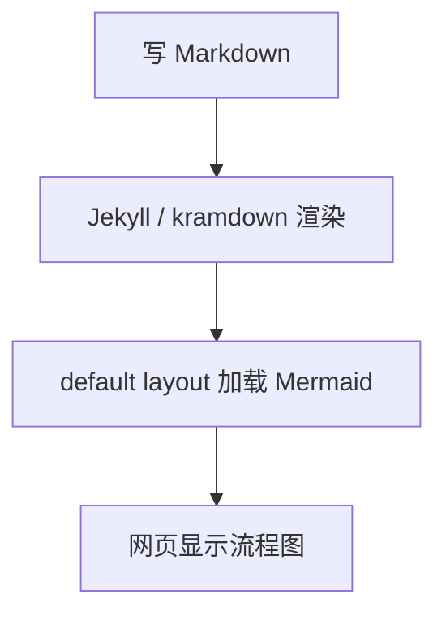
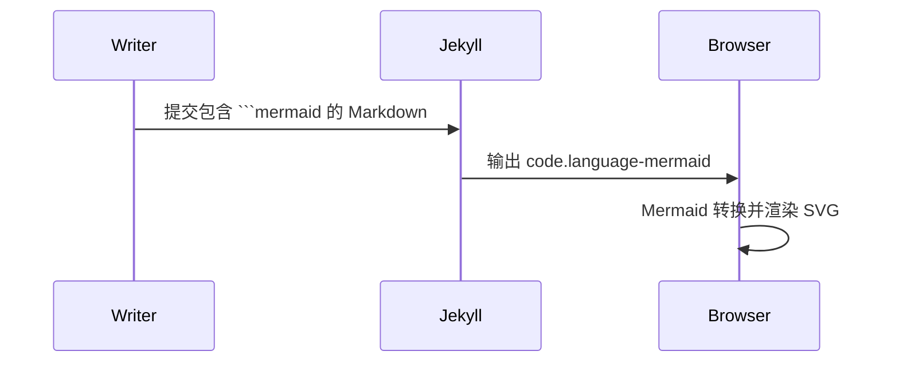

这个页面用于测试在 GitHub Pages 的 Markdown 页面里使用 Mermaid 流程图，并让图表在网页端直接渲染，而不是显示成普通代码块。

## Flowchart

下面使用的是标准 Markdown fenced code block：

````markdown

````


## Sequence diagram



## 说明

- Mermaid 只在 front matter 里设置 `mermaid: true` 的页面加载。
- 普通 Markdown 文章仍然不额外加载 Mermaid 脚本。
- 图表语法使用标准代码块：```` ```mermaid ````。
